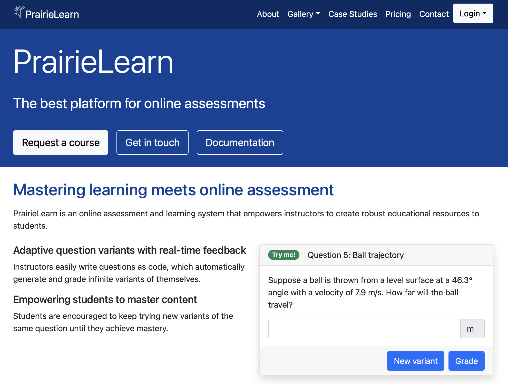

# Introduction to PrairieLearn

## Learning Intentions

By the end of this section, we intend for learners to be able to:

- Understand the purpose and origin of PrairieLearn as well as its open source philosophy.
- Describe the front-end of the PrairieLearn platform and discuss its potential for use in a classroom.
- Understand how PrairieLearn can be extended to support a variety of use-cases across multiple disciplines.

## What is PrairieLearn?

PrairieLearn is an open source, extensible online learning platform that is built on modern web technologies.
The platform is more than suitable for use as an assessment engine in a variety of fields including the humanities, arts, economics, as well as social, physical, and life sciences.
At its core, PrairieLearn allows students to get immediate and personalized feedback on questions and affords students multiple attempts to achieve proficiency.
The level of sophistication is just not possible with traditional assessments done on paper, even with AI-assisted tools to manage, collate, and grade thousands of sheets of paper in large classes. 
With immediate feedback on attempts and the opportunity to try additional variants of problems, PrairieLearn provides a learning experience that is better for students and has lower administrative and logistical overhead.
An additional benefit of immediate feedback is that students will *actually* engage with the feedback in a meaningful way.
This is in contrast to what is quite common in classrooms where piles of hand-graded written homework that are never picked up, weeks after they were turned in.

:::{figure-md} markdown-fig

The PrairieLearn homepage has a lot of information about use-cases as well as research literature on the efficacy of various teaching techniques involving PrairieLearn.
:::

All the question types that one would expect in a modern assessment platform are [already available](https://prairielearn.readthedocs.io/en/latest/elements/) on PrairieLearn, but the list of available question types are constantly being expanded as more instructors join the community.
Today, there is also a strong [community of users (Slack Invite)](https://go.illinois.edu/PrairieLearnSlack) and [developers](https://github.com/PrairieLearn/PrairieLearn/graphs/contributors) who frequently contribute new features, improvements, and fixes to PrairieLearn.
Many of these contributors are from institutions across the United States and Canada.

## History of PrairieLearn

PrairieLearn is the evolution of over 10 years of tool building and refinement by various faculty, staff, and students at the University of Illinois.
Its' mission is to open the door for instructors to improve their teaching workflows without compromising the quality of education they are delivering to students.
The tool was originally built by faculty and staff at the University of Illinois to maintain a high quality education in large enrolment classes.
Through algorithmic randomization and autograding, course staff were freed from mundane and repetitive tasks, allowing them to focus on critical activities that humans perform better than software: giving students personalized feedback on more authentic open-ended tasks.
PrairieLearn began as open-source software and its founders have vowed this will remain so [forever](https://www.prairielearn.com/about). 
This means that institutions and individuals can run the software on their own infrastructure and make changes to it, as needed.
However, over time it became clear that most instructors would rather focus on running their courses instead of operating and scaling software.
PrairieLearn, Inc. was started to provide a paid hosting option for institutions and individuals that are not experts in server administration.
PrairieLearn is [now available commercially](https://www.prairielearn.com/pricing) as a fully hosted [FERPA (USA)](https://studentprivacy.ed.gov/faq/what-ferpa) and [PIPEDA (Canada)](https://www.priv.gc.ca/en/privacy-topics/privacy-laws-in-canada/the-personal-information-protection-and-electronic-documents-act-pipeda/pipeda_brief/) compliant service.
This has allowed the platform to benefit more institutions, students, and educators.

## PrairieLearn Community and PrairieLearn Enterprise

- Point 1
- Point 2
- Point 3

## Where is PrairieLearn being used?

- Point 1
- Point 2
- Point 3

## PrairieLearn Interface

- Point 1
- Point 2
- Point 3

<!-- 
## Extra Stuff

As with any cloud-based technology, there are costs associated with hosting and compute resources.

with all aspects of technical support, managing, troubleshooting, and load balancing included in the per-person, per-course cost.
However, since many institutions have in-house expertise to handle these tasks, community-hosted documentation is available for institutions (and individual instructors) to self-host PrairieLearn instances. -->
