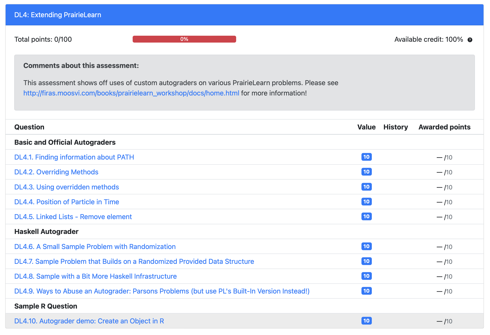

# External graders

PrairieLearn supports [external graders](https://prairielearn.readthedocs.io/en/latest/externalGrading/) for assessment of students' submissions that is highly customizable. A common use case is to assess student-submitted code against tests and give a grade and feedback based on the test results.

If you are working in [Python](https://prairielearn.readthedocs.io/en/latest/python-grader/), [C or C++](https://prairielearn.readthedocs.io/en/latest/c-grader/), or [Java](https://prairielearn.readthedocs.io/en/latest/java-grader/), you will likely want to use the provided external graders.

If you have your own "boutique" language, someone in the PrairieLearn community may already have developed an external grader they can share with you. ([Haskell anyone](https://github.com/steven-wolfman/haskell-prairielearn)?) You can also take an existing external grader and adapt it to your needs.

## [Discover and Learn 4](https://us.prairielearn.com/pl/course_instance/133045/assessment/2336781)

What can you do with your external grader? 
Let's try out some examples that show what's possible.

:::{figure-md} markdown-fig


This assessment contains several examples of several externally graded questions.
:::

### A Boutique external grader with Custom Randomization

Let's try out a custom [Haskell external grader](https://github.com/steven-wolfman/haskell-prairielearn). This is very much founded on Mattox Beckman's Haskell external grader!

---

To begin with, you want to have a sense of the programming language, the type of problems, and the test framework you want to use for your external grader.

I wanted to test students on constructing small programs in Haskell, generally within a single file. I felt somewhat comfortable with Haskell's awesomely powerful [QuickCheck framework](https://hackage.haskell.org/package/QuickCheck).

#### A First Question: Programming, Tests, and Randomization

With PL and a Haskell external grader, I could write simple programming queries like this one: TODO, steve/small-sample-with-randomization.

Let's solve it badly with a function that takes anything (`_`) and produces `0`.

---

It gives us a score broken out by weighted test cases and some admittedly cryptic feedback on failed test cases. (Improving that feedback is possible and is just part of the code for the external grader! QuickCheck is doing its job and providing compact counterexamples; I'm just not doing my job and rendering those in a readable fashion to students!)

---

I also wanted to be able to easily randomize problems. So, I built into my external grader an initial pass with a mustache processor that works much like the one used for `question.html`.

Let's grab a few new variants and see how PL generates variation across different students.

----

What does that look like on the back end? Let's take a look in the "Files" tab and see what my `tests/test/Spec.mustache.hs` file looks like. I built in code like:

```haskell
getOp "difference" = (-)
getOp "product" = (*)
getOp "sum" = (+)
getOp "absolute difference (absolute value of the difference)" = absDiff
getOp _ = (-)
```

That now lets me make a call like `getOp "{{params.op}}"` and get back the function I want for the randomized operation I asked students to implement.

#### A Second Question: Setting the Student Up

Here's a similar problem except that it requires significantly more setup to get the student's code started: TODO, steve/sample-with-randomization-and-setup

The external grader I'm using makes it easy for me to place the student's code inside a module I specify. Check out the 
`tests/src/Lib-header.mustache.hs` to see what that looks like. I use nearly the same mustache code here as in my `question.html` file to lay out the datatype students build on.

---

Shall we solve it, just for fun? We should all know Haskell! 😁

#### Two More Questions to Check Out If You Like

You may also be interested in these two other questions:

+ TODO `steve/more-haskelly-sample` is similar to what we've already seen but has a bit more Haskell infrastructure, such as in its test file. (I have many more examples that lean more heavily into QuickCheck).
+ TODO `steve/very-different-use-of-student-code` shows how we can abuse the external grader setup PrairieLearn provides us to create other styles of problem. There are probably better ways to do this (!!), but once you have an external grader, you have scaffolding that you *can* use to make creative new styles of question.

## How Do I Get Started With An External Grader

See the ]PrairieLearn docs](https://prairielearn.readthedocs.io/en/latest/externalGrading/) to get started on writing your own External Grader.

<!-- 
TODO: talk about getting Docker set up, adapting an existing external grader, re-link to the documentation, caution about "caching" resources needed in the external grader so preparation isn't slow.
 -->

